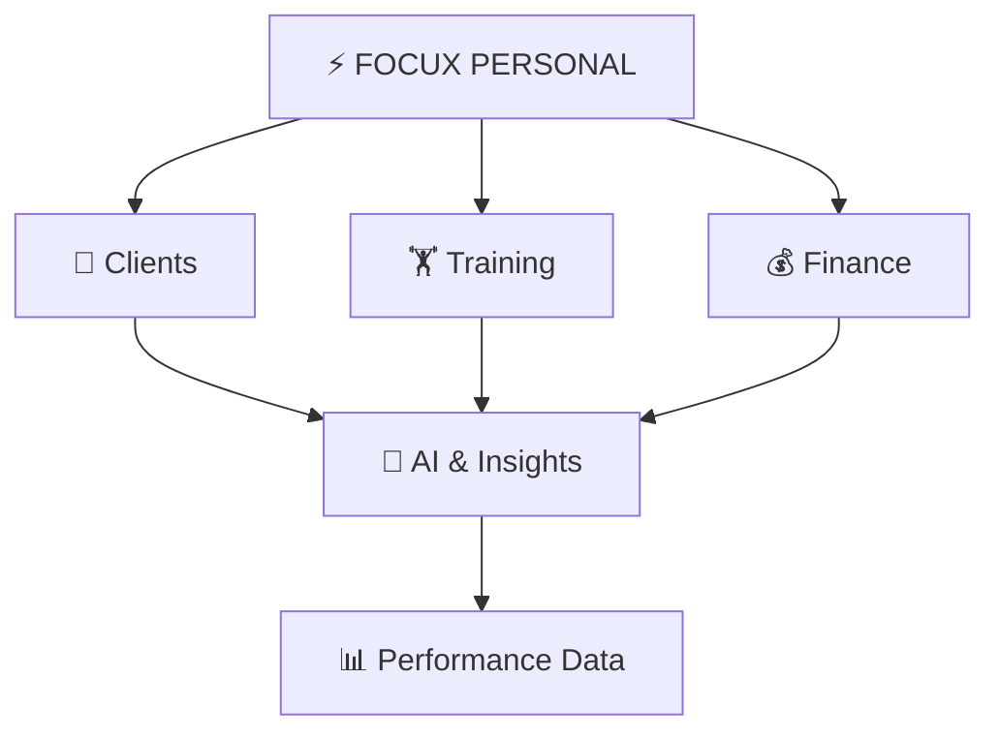

  

---

## 🚀 About Me

I'm a **Software Developer** and **SaaS Builder** focused on turning ideas into real, scalable products.

I work mainly with backend development, mobile applications, cloud infrastructure and AI-powered features, building systems **from architecture to production**.

Right now I'm building **[Focux Personal](https://focuxpersonal.com)**, a SaaS platform for personal trainers to manage their business, clients and performance in one ecosystem.

> 💬 *I don't just write code. I build products.*

---

## 🧠 What I Build

| Area | Focus |
| :-- | :-- |
| 🏗️ **SaaS** | Multi-tenant platforms, business systems & scalable architecture |
| 📱 **Mobile** | Cross-platform applications with Flutter |
| ⚙️ **Backend** | REST APIs, authentication, business logic & integrations |
| 🤖 **AI** | AI-powered features, automation & intelligent workflows |
| ☁️ **Cloud** | Deployment, infrastructure & production environments |
| 🔐 **Security** | Secure APIs, authentication & application security |

---

## ⚡ Featured Product

### [Focux Personal](https://focuxpersonal.com)

**Treine com dados. Evolua com inteligência.**

Focux Personal is a SaaS platform created and developed from scratch to help personal trainers manage their entire operation: clients, training, finance, CRM, analytics and intelligent features.

---

## 🛠️ Tech Stack

**Backend** 

**Mobile** 

**Cloud & Infrastructure** 

**Tools & Workflow** 

**🤖 AI & Modern Development:** `Artificial Intelligence` · `LLM Applications` · `AI-assisted Development` · `Automation` · `Intelligent Workflows` · `API Integrations`

---

## 📌 Selected Projects

| Project | Description | Stack |
| :-- | :-- | :-- |
| ⚡ **[Focux Personal](https://focuxpersonal.com)** | Platform for personal trainers with client management, training, finance, CRM, analytics and intelligent features. | `SaaS` `Mobile` `AI` |
| 🏢 **Faculdade Goiás** | Institutional web platform built with a modern full-stack architecture. | `Next.js` `Payload CMS` `Vercel` `Neon` |

---

## 🔭 Currently Building

**Focux Personal**, a modern SaaS ecosystem for personal trainers powered by data, automation and AI.

- 🧠 AI-powered product features
- 🏗️ Scalable SaaS architecture
- 📱 Mobile experience
- 🔐 Security & authentication
- ☁️ Cloud infrastructure
- 📊 Data & performance analytics
- ⚙️ Automation & integrations

## 🌱 Currently Exploring

`AI Engineering` → `Cloud Architecture` → `Cybersecurity` → `Scalable Systems` → `Product Engineering`

---

## 📊 GitHub Analytics

 

 

### ✦ Contribution Activity

---

## 💡 Engineering Philosophy

`Ideas` → `Architecture` → `Development` → `Testing` → `Deployment` → `Real Users` → `Continuous Improvement`

Great software is not only about technology. It's about **solving real problems**, creating useful products and continuously improving them.

---

⚡ *Building consistently. Shipping continuously.*

**Building products where technology, AI and performance meet.**

© Matheus Oliveira

