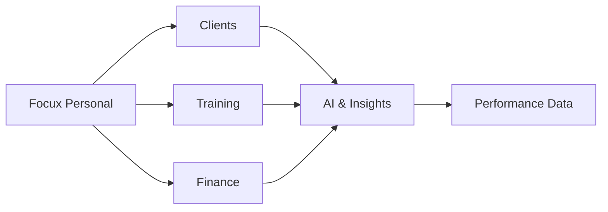

# Matheus Oliveira

**Software Developer · SaaS Builder · Mobile · AI**

[Focux Personal](https://focuxpersonal.com) &nbsp;•&nbsp; [Instagram](https://www.instagram.com/devmatheusbb) &nbsp;•&nbsp; [Email](mailto:matheusos1912@icloud.com)

---

I'm a software developer focused on turning ideas into real, scalable products. I work mainly with backend development, mobile applications, cloud infrastructure and AI-powered features, taking systems from architecture all the way to production.

I'm the creator of **[Focux Personal](https://focuxpersonal.com)**, a SaaS platform that helps personal trainers manage their business, clients and performance in one place.

> I don't just write code. I build products.

## What I'm working on

| Category | Description |
| :-- | :-- |
| **Building** | [Focux Personal](https://focuxpersonal.com): a SaaS ecosystem for personal trainers powered by data, automation and AI. |
| **Focus areas** | AI-powered product features, scalable SaaS architecture, mobile experience, security & authentication, cloud infrastructure, data & performance analytics, automation & integrations. |
| **Exploring** | AI engineering, cloud architecture, cybersecurity, scalable systems, product engineering. |

## Featured product

### [Focux Personal](https://focuxpersonal.com)

*Treine com dados. Evolua com inteligência.*

Created and developed from scratch, Focux Personal gives personal trainers one ecosystem to run their entire operation:

- **Clients and CRM**: manage every client relationship in one place
- **Training**: plan and track training for each client
- **Finance**: keep the business side under control
- **Analytics**: turn performance data into decisions
- **AI & insights**: intelligent features built on top of that data

## What I build

| Area | Focus |
| :-- | :-- |
| **SaaS** | Multi-tenant platforms, business systems & scalable architecture |
| **Frontend** | Modern web interfaces and full-stack applications with Next.js and React |
| **Mobile** | Cross-platform applications with Flutter |
| **Backend** | REST APIs, authentication, business logic & integrations |
| **AI** | AI-powered features, automation & intelligent workflows |
| **Cloud** | Deployment, infrastructure & production environments |
| **Security** | Secure APIs, authentication & application security |

## Tech stack

| | |
| :-- | :-- |
| **Backend** |  |
| **Frontend** |  |
| **Mobile** |  |
| **Cloud & Infra** |  |
| **Tools** |  |

**AI & modern development:** LLM applications · AI-assisted development · automation · intelligent workflows · API integrations

## Selected projects

| Project | Description | Stack |
| :-- | :-- | :-- |
| **[Focux Personal](https://focuxpersonal.com)** | Platform for personal trainers: client management, training, finance, CRM, analytics and intelligent features. | SaaS · Mobile · AI |
| **Faculdade Goiás** | Institutional web platform with a modern full-stack architecture. | Next.js · Payload CMS · Vercel · Neon |

## GitHub activity

  

<picture>
  <source media="(prefers-color-scheme: dark)" srcset="https://raw.githubusercontent.com/devmatheus1912/devmatheus1912/output/github-snake-dark.svg" />
  <source media="(prefers-color-scheme: light)" srcset="https://raw.githubusercontent.com/devmatheus1912/devmatheus1912/output/github-snake.svg" />
  
</picture>

## Engineering philosophy

Ideas → architecture → development → testing → deployment → real users → continuous improvement.

Great software is not only about technology. It's about solving real problems, creating useful products and continuously improving them.

---

**Let's connect:** [GitHub](https://github.com/devmatheus1912) &nbsp;•&nbsp; [Instagram](https://www.instagram.com/devmatheusbb) &nbsp;•&nbsp; [focuxpersonal.com](https://focuxpersonal.com) &nbsp;•&nbsp; [Email](mailto:matheusos1912@icloud.com)

*Building products where technology, AI and performance meet.*

